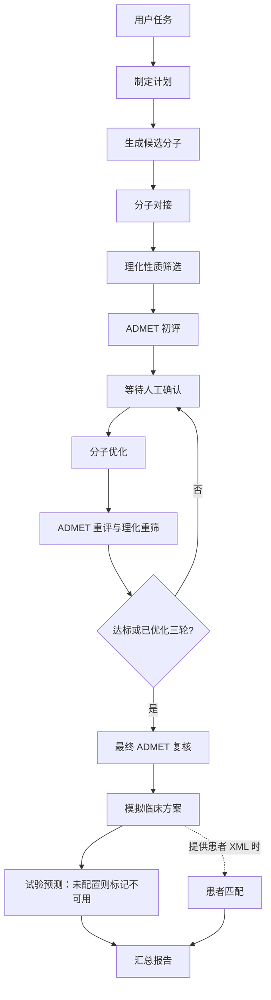

# DrugForge｜面向药研流程的多 Agent 编排原型

基于 **LangGraph + MCP** 串联分子生成、对接、性质筛选、分子优化与临床方案模拟。支持阶段工具校验、人工确认、条件分支与执行记录。

仓库提供可独立运行的离线演示。真实模型链路需要额外的 API、模型权重及对接软件；目前已验证工程流程，尚未验证药研效果。

## 快速体验

轻量演示无需 API Key、GPU 或模型权重，复用真实主图和优化子图，使用明确标记的模拟节点输出。

```bash
git clone https://github.com/Trojan-Miracle/Multi-agent_DrugForge.git
cd Multi-agent_DrugForge
python -m venv .venv
source .venv/bin/activate
# Windows PowerShell: .venv\Scripts\Activate.ps1
python -m pip install -r requirements-dev.txt
python check_env.py --demo
python demo.py --with-patients
```

打开 `runs/demo.html` 查看执行步骤，`runs/demo.json` 保存事件记录。演示包含三轮优化、三次暂停与恢复，以及可选的患者匹配分支。演示自动确认；真实运行需要在浏览器点击确认。模拟节点不执行科学推断，也不调用领域 MCP 服务。

```bash
python demo.py                         # 不启用患者分支
python -m pytest -q                    # 工程回归测试，包含本地 MCP 会话测试
```

[配置模板](.env.example) · [验证范围与已知限制](docs/VALIDATION.md)

## 工作流程



图控制阶段顺序，阶段内部 Agent 使用指定工具。对接和 ADMET 分别绑定工具；初评、重评和终评有独立任务指令。患者分支通过 `--patients` 显式启用。

## 工程机制

| 机制 | 当前实现 |
|---|---|
| 阶段约束 | 专用工具列表与阶段指令，缺少必要工具时启动失败 |
| 工具结果校验 | 必需阶段须有成功工具调用；检测显式及嵌套 JSON 错误，防止仅凭 Agent 文字继续 |
| 执行边界 | Agent 阶段超时 600 秒、内部图步数 24；优化判断超时 120 秒；优化最多三轮 |
| 人工确认 | 每轮独立确认令牌，拒绝过期与重复请求，刷新页面可恢复待确认状态 |
| MCP 会话 | 一次运行内保持服务进程会话，结束后关闭，避免每次调用重新加载模型 |
| 执行记录 | 完整消息、阶段摘要、工具调用 ID、工具输出与阶段耗时；日志通过原子替换保存 |
| 最终报告 | 检查最终汇总节点、必要章节与结束标记，保存 Markdown 报告；格式检查不验证科学正确性 |
| 可选预测 | 未配置专用临床预测检查点时明确返回不可用，不使用基础编码器生成概率 |

`stage_results` 保存各阶段最近一次结果；完整历史消息保存在运行日志中。每个 Agent 的输出仍包含自然语言摘要，尚未建立覆盖所有药研端点的结构化数据契约。

## MCP 服务

| 文件 | 集成能力 |
|---|---|
| `druggen_mcp_server.py` | DrugGen 分子生成 |
| `docking_mcp_server.py` | AutoDock Vina / P2Rank 对接 |
| `chemical_properties_mcp_sever.py` | RDKit 理化性质与规则筛选（保留原文件名） |
| `admet_prediction_mcp_server.py` | ChemFM ADMET 预测 |
| `mol_opt_mcp_server.py` | DrugAssist 分子优化 |
| `name2smiles_mcp_server.py` | 名称与 SMILES 转换工具，供扩展使用 |
| `trialgen_mcp_server.py` | Panacea 临床方案组件生成 |
| `patient_matching_mcp_server.py` | Panacea 患者匹配，报告处理失败数量 |
| `trialpred_mcp_server.py` | MediTab 预测适配器，需配置专用检查点 |

## 真实模型运行

完整模型环境以 Python 3.11 为目标。`requirements.txt` 保留原始模型环境依赖并固定核心编排版本，全量环境尚未完成复现。

```bash
python -m pip install -r requirements.txt
# 按推理环境另行安装 llama-cpp-python、accelerate、bitsandbytes
# 并配置各模型权重以及以下外部代码：
git clone https://github.com/mahsasheikh/DrugGen.git
git clone https://github.com/RyanWangZf/MediTab.git
```

对接还需 AutoDock Vina、Open Babel、Java 和 P2Rank。原始环境使用 Vina 1.1.2、Open Babel 3.1.1、P2Rank 2.5.1；模型和工具之间的版本兼容性需在实际环境验证。

参考 `.env.example` 设置环境变量，程序不会自动加载该文件：

| 变量 | 用途 |
|---|---|
| `DEEPSEEK_API_KEY` | LLM API 密钥 |
| `DEEPSEEK_MODEL` / `DEEPSEEK_PRO_MODEL` | 可覆盖的模型名，以账号实际可用模型为准；当前主流程使用前者 |
| `DEEPSEEK_BASE_URL` | 可覆盖的 API 地址 |
| `PANACEA_MODEL` | Panacea 模型路径或仓库 ID |
| `P2RANK_PATH` | P2Rank 安装目录 |
| `DRUGASSIST_MODEL_PATH` | 本地 GGUF 路径；未设置时尝试下载 |
| `HF_TOKEN` | 可选，用于 Hugging Face 服务或模型访问 |
| `MEDITAB_MODEL_PATH` | 可选，专门训练的单 logit 二分类检查点，正类必须代表成功；校准效果需独立验证 |

```bash
export DEEPSEEK_API_KEY="your-key"
python check_env.py --offline       # 本地环境检查
python check_env.py                 # 另检查 API 连通性
python DrugForge.py --task "模拟DPP4(P27487)的药物开发"
```

打开 `http://localhost:8765`，在优化前点击“确认继续优化”。命令行也支持：

```bash
python DrugForge.py --task "模拟DPP4(P27487)的药物开发" --patients diabetes_patients_final.xml
python DrugForge.py --port 8766 --exit-on-complete
```

缺少必需配置或阶段执行失败时会保存失败状态并退出。成功后默认保留面板，按 `Ctrl+C` 关闭；`--exit-on-complete` 用于完成后退出。

## 运行记录

- `runs/{run_id}.json`：消息、阶段结果、耗时和运行状态。
- `runs/{run_id}.md`：通过格式检查的最终汇总报告。
- `runs/`、密钥配置和模型权重默认不纳入 Git。

```bash
python state.py
python state.py --show YOUR_RUN_ID
```

JSON 日志用于回放；当前图检查点保存在内存中，进程重启后不能直接续跑。

## 可选追踪与记忆

设置 `LANGCHAIN_API_KEY` 可启用 LangSmith 调用追踪。安装可选的 Mem0 依赖并设置 `MEM0_API_KEY` 后，系统会检索和保存历史任务偏好。启用后，相应任务数据会发送到所配置的服务。

## 数据与验证边界

仓库附带合成患者 XML。原项目的数据生成说明引用了 [Synthea](https://github.com/synthetichealth/synthea) 和 [patient2trial](https://github.com/surdatta/patient2trial)；患者匹配解析器实际读取 `topic / text_version` 格式。

当前测试验证流程和软件行为。分子生成质量、ADMET 端点解释、患者匹配效果、临床预测校准和完整模型链路仍需独立验证，详见[验证说明](docs/VALIDATION.md)。
