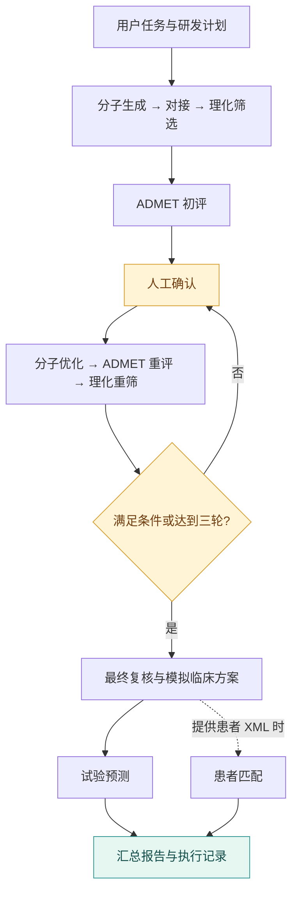

<div align="center">

# DrugForge

**面向药研流程的多 Agent 编排原型**

从候选分子到模拟临床方案，将领域工具、执行约束与人工决策串联起来。

`Python` · `LangGraph` · `MCP` · `Human-in-the-loop`

[快速体验](#快速体验) · [架构设计](#架构设计) · [模型配置](docs/SETUP.md) · [验证范围](docs/VALIDATION.md)

</div>

## 架构设计

**外层状态图控制流程，内层 Agent 调用专用工具。** 对接与 ADMET 分别绑定工具；初评、重评和终评使用独立任务指令。仓库包含 **9 个领域 MCP 连接器**。



## 关键工程设计

| 关注点 | 实现 |
| :--- | :--- |
| **流程可控** | 条件路由、并行分支、优化子图；最多三轮优化，阶段设超时与步数上限 |
| **结果有据** | 必需阶段校验成功工具调用，识别嵌套错误；记录工具调用 ID、原始输出与阶段耗时 |
| **人工介入** | 每轮独立确认令牌，拒绝过期和重复请求；刷新页面后可继续当前审批 |
| **会话复用** | MCP 服务在一次运行中保持连接，复用模型进程，结束后统一释放 |
| **记录可查** | 原子写入 JSON 日志，保存阶段结果和完整消息，导出 Markdown 汇总报告 |
| **失败明确** | 必需工具失败时停止；未配置临床预测模型时标记“不可用”，不生成替代概率 |

核心实现：[流程编排](DrugForge.py) · [阶段校验](workflow_runtime.py) · [运行记录](state.py)

## 快速体验

**无需 API Key、GPU 或模型权重。** 离线演示复用真实状态图，以模拟节点输出验证流程。

```bash
git clone https://github.com/Trojan-Miracle/Multi-agent_DrugForge.git
cd Multi-agent_DrugForge
python -m venv .venv
source .venv/bin/activate
python -m pip install -r requirements-dev.txt
python demo.py --with-patients
```

Windows PowerShell 使用 `.venv\Scripts\Activate.ps1` 激活环境。

打开 **`runs/demo.html`** 查看三轮优化、暂停恢复和临床分支；**`runs/demo.json`** 保存事件记录。演示自动确认，真实运行需在浏览器手动确认。模拟输出不包含科学推断。

```bash
python check_env.py --demo    # 检查轻量运行环境
python -m pytest -q           # 执行工程回归测试
```

## 验证与边界

本地已通过 **40 项测试**，覆盖图执行、终止条件、阶段工具校验、人工确认、日志写入与本地 MCP 会话。[CI](.github/workflows/tests.yml) 配置 Python 3.11 / 3.13 检查，并生成演示文件。

真实模型链路仍需配置和联调，药研效果尚未验证。当前支持进程内暂停恢复，尚不支持重启后续跑；端点语义和临床预测校准需独立验证。

→ [模型配置与工具目录](docs/SETUP.md) · [详细验证范围与已知限制](docs/VALIDATION.md)
