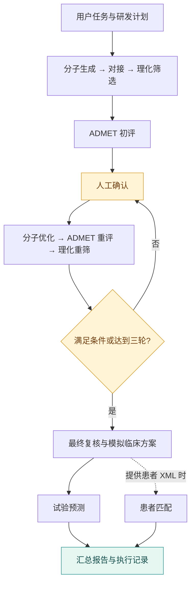

<div align="center">

# DrugForge

**面向药研流程的多 Agent 编排原型**

从候选分子到模拟临床方案，将领域工具、执行约束与人工决策串联起来。

`Python` · `LangGraph` · `MCP` · `Human-in-the-loop`

[快速体验](#快速体验) · [架构设计](#架构设计) · [模型配置](docs/SETUP.md) · [真实验证](docs/SCIENCE_VALIDATION.md)

</div>

## 架构设计

**外层状态图控制流程，内层 Agent 调用专用工具。** 对接与 ADMET 分别绑定工具；初评、重评和终评使用独立任务指令。仓库包含 **9 个领域 MCP 连接器**。



## 关键工程设计

| 关注点 | 实现 |
| :--- | :--- |
| **流程可控** | 条件路由、并行分支与优化子图；阶段超时和步数限制，最多三轮优化 |
| **结构化交接** | Pydantic 数据契约传递分子、性质、筛选与试验方案；调用前校验分子和输入一致性 |
| **人工介入** | 每轮独立确认令牌，拒绝过期和重复请求；恢复后重新确认待审批步骤 |
| **持久恢复** | SQLite 保存图状态；进程退出后按运行 ID 续跑，互斥锁防止同时恢复同一任务 |
| **证据报告** | 从工具数据生成报告，每个数值关联原始输入、输出、JSON 路径与完整性哈希 |
| **执行评测** | 固定任务基准与真实日志评测；统计完成率、调用正确率、耗时、参考答案得分及可用的成本估算 |
| **会话与失败** | MCP 会话复用；必需工具失败时停止，可选预测不可用时明确标记 |

核心实现：[数据契约](contracts.py) · [阶段执行](workflow_runtime.py) · [恢复](persistence.py) · [来源报告](reporting.py) · [评测](evaluate.py)

## 快速体验

**无需 API Key、GPU 或模型权重。** 离线演示复用真实状态图，以模拟节点输出验证流程。

```bash
git clone https://github.com/Trojan-Miracle/Multi-agent_DrugForge.git
cd Multi-agent_DrugForge
python -m venv .venv
source .venv/bin/activate
python -m pip install -r requirements-dev.txt
python demo.py --with-patients
```

Windows PowerShell 使用 `.venv\Scripts\Activate.ps1` 激活环境。

打开 **`runs/demo.html`** 查看三轮优化、暂停恢复和临床分支；**`runs/demo.json`** 保存事件记录。演示自动确认，真实运行需在浏览器手动确认。模拟输出不包含科学推断。

```bash
python check_env.py --demo    # 检查轻量运行环境
python -m pytest -q           # 执行工程回归测试
python evaluate.py             # 运行离线任务基准，输出评测报告
```

## 验证与边界

自动化测试覆盖结构化交接、跨进程恢复、人工确认、证据完整性、成本统计、MCP 会话及科学计算回归。[CI](.github/workflows/tests.yml) 配置 Python 3.11 / 3.13 工程检查与独立的 CPU 科学测试。

已完成 **DeepSeek → MCP → RDKit 真实调用**、**DrugGen GPU 分子生成**、**Vina 实验结构重对接**及 **ChemFM hERG / Ames 公开基准复现与基线比较**。1IEP 已知口袋姿态偏差为 0.36 Å，P2Rank 自动口袋分支为 12.64 Å，成功与失败结果均保留。[查看方法、原始结果和复现命令](docs/SCIENCE_VALIDATION.md)。

三组 DrugAssist 优化对照均未改善最终 hERG 风险预测，负结果也已公开。这些实验不证明新分子的药效；完整临床链路与患者匹配仍需验证。恢复以图节点为边界，失败节点内部的工具调用可能重做。

→ [数据、恢复与评测指南](docs/ENGINEERING.md) · [模型配置与工具目录](docs/SETUP.md) · [详细验证范围与已知限制](docs/VALIDATION.md)
